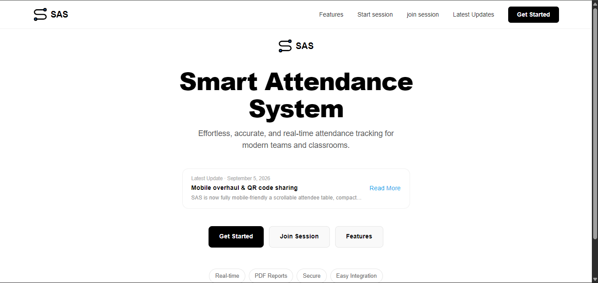

# SAS — Smart Attendance System

<p align="center">
  
</p>

<p align="center">
  <b>A modern, lightning-fast, and reliable attendance tracking platform built for modern teams and institutions.</b>
</p>

<p align="center">
  
  
  
  
</p>

---

## Overview

**SAS (Smart Attendance System)** is a streamlined web application engineered to eliminate the friction of traditional roll calls. Whether you are managing a classroom, a corporate team, or workshop sessions, SAS gives you real-time tracking, seamless session management, and instant analytics with type-safe reliability.

---

## Key Features

* **Instant Session Joining:** Attendees can join active sessions with a single tap or click.
* **Real-time Tracking:** Monitor check-ins live as they happen without page refreshes.
* **Type-Safe Architecture:** Built with strict TypeScript and React to ensure rock-solid performance and developer ergonomics.
* **Modern UI/UX:** Styled cleanly using Tailwind CSS and Framer Motion micro-interactions for a silky smooth experience.
* **Responsive Design:** Optimized for mobile phones, tablets, and desktop displays.

---

## Preview

<p align="center">
  
</p>

---

## Tech Stack

* **Frontend:** React, TypeScript
* **Styling:** Tailwind CSS, Framer Motion
* **Routing & State:** Next.js / React Router ecosystem

---

## Getting Started

Follow these steps to get your local development environment running.

### Prerequisites

Make sure you have Node.js (v18+) and npm/yarn installed on your machine.

### Installation

1. **Clone the repository**
   ```bash
   git clone [https://github.com/ayoolaowoilu/sas.git](https://github.com/ayoolaowoilu/sas.git)
   cd sas

```

2. **Install dependencies**
```bash
npm install
# or
yarn install

```


3. **Run the development server**
```bash
npm run dev
# or
yarn dev

```


4. Open [http://localhost:3000](http://localhost:3000) in your browser to view the app.

---

## Project Structure

```text
├── public/           # Static assets (including image.svg logo)
├── components/       # Reusable UI components (Cards, Modals, Navbars)
├── pages / app/      # Application routes and views
├── styles/           # Global styles and Tailwind configs
└── types/            # TypeScript interfaces and type definitions

```

---

## Contributing

Contributions, issues, and feature requests are welcome! Feel free to check the issues page.

1. Fork the Project
2. Create your Feature Branch (`git checkout -b feature/AmazingFeature`)
3. Commit your Changes (`git commit -m 'Add some AmazingFeature'`)
4. Push to the Branch (`git origin push feature/AmazingFeature`)
5. Open a Pull Request

---

## License

Distributed under the MIT License. See `LICENSE` for more information.